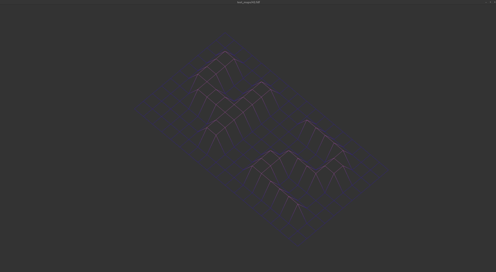
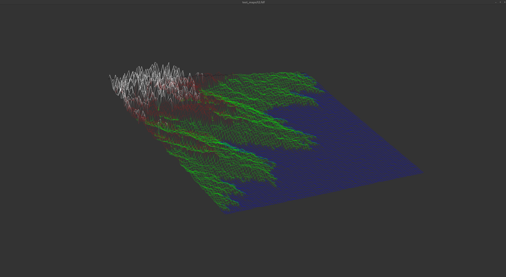
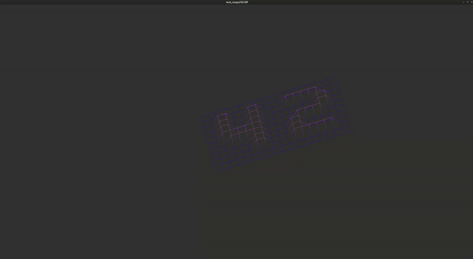

# FDF: Wireframe Representation Project

This project is part of the 42 curriculum and focuses on 2D graphics rendering. It visualizes a 3D map in an isometric view, providing a 3D-like representation on a 2D plane. The project includes features such as isometric projections, color interpolation, and interactive controls.

---

## Features

### Core Features
- **Map Parsing:** Reads `.fdf` map files and stores data in a structured format.
- **Isometric Projections:** Applies rotation and transformation formulas to display the map in a 3D-like isometric view.
- **Line Drawing:** Utilizes Bresenham's line algorithm for rendering grid lines between points.
- **Height Scaling:** Dynamically adjusts the Z-values for better visualization of terrain features.

## Isometric Projection
This project uses isometric projection formulas:
```c
x' = (x - y) * cos(30°);
y' = -z + (x + y) * sin(30°);
```
These formulas calculate 2D coordinates for each point in the 3D grid, creating an illusion of depth.

### Color Handling
- **Height-Based Color Interpolation:**
  - Colors are dynamically calculated based on the height (`z`) of the points using a gradient interpolation.
  - Example gradient:
    - Low points: Purple
    - High points: Pink
- **Custom Colors:**
  - Supports reading colors embedded in the `.fdf` file in hexadecimal format (e.g., `0xFFFFFF`).
  - Missing colors default to white.


## Example Maps
**42.fdf:** A simple map showcasing the number 42 rendered in isometric view.



**t2.fdf:** A map representing a mountain-like terrain.



## Interactive Controls

This project uses hooks to provide an interactive experience. Below is a list of available controls and their corresponding actions:

### Movement
- **Arrow Keys (Up, Down, Left, Right):** Move the map within the window by adjusting the `x_offset` and `y_offset` values.

### Zoom
- **Z Key:** Zoom in by increasing the `zoom` value.
- **X Key:** Zoom out by decreasing the `zoom` value (minimum zoom is 0.01).

### Rotation
- **Q/A Keys:** Rotate along the X-axis clockwise/counterclockwise.
- **W/S Keys:** Rotate along the Y-axis clockwise/counterclockwise.
- **E/D Keys:** Rotate along the Z-axis clockwise/counterclockwise.

### Scaling
- **Equal (=) Key:** Decrease the Z-scale for flattening the map (multiplying `z_scale` by 0.99).
- **Minus (-) Key:** Increase the Z-scale for exaggerating height (multiplying `z_scale` by 1.01).

### Exit
- **ESC Key:** Close the program.

---

## How Hooks Work

Hooks are used to listen for specific keyboard inputs and modify the map or rendering parameters in real time. Here are the key components:

1. **Zoom Handling:**
   - Adjusts the zoom factor (`zoom`) using the `Z` and `X` keys.
   ```c
   if (mlx_is_key_down(mlx, MLX_KEY_Z))
       map->zoom += zoom_speed;
   if (mlx_is_key_down(mlx, MLX_KEY_X))
       map->zoom -= zoom_speed;

2. **Rotation Handling:**
    - Rotates the map along the X, Y, and Z axes using keys Q, A, W, S, E, and D.
    ```c
    if (mlx_is_key_down(mlx, MLX_KEY_Q))
        map->rotation_x += rotation_speed;
    if (mlx_is_key_down(mlx, MLX_KEY_A))
        map->rotation_x -= rotation_speed;

3. **Movement Handling:**
    - Moves the map using the arrow keys by adjusting the x_offset and y_offset.
    ```c
    if (mlx_is_key_down(mlx, MLX_KEY_UP))
        map->y_offset -= 0.1;
        
4. **Scaling Handling:**
    -Dynamically scales the height of the map using = and - keys by modifying the z_scale factor.
    ```c
    if (mlx_is_key_down(mlx, MLX_KEY_EQUAL))
        map->z_scale *= 0.99;

**Event Loop Hook:**

Combines all interactions into a single loop that continuously checks for keypresses and updates the map accordingly.
```c
    void loop_hook(void *param)
    {
        handle_movement(mlx, map);
        handle_scaling(mlx, map);
        handle_rotation(mlx, map);
        handle_zoom(mlx, map);
        redraw(mlx, map);
    }
```
## How to Use

### Clone the Repository
To get started, clone the repository and navigate into the project directory:
```bash
git clone https://github.com/djelacik/fil_de_fer
cd fil_de_fer
```

### Compile the Project
Build the project using the make command:

```bash
make
```
Run the compiled program with a valid .fdf map file:

```bash
./fdf test_maps/42.fdf
```
#### Interact with the Map
Use the keyboard controls listed above to rotate, zoom, translate, and scale the map.

## Visual Highlights

### Interactive Map
Zoom, rotate, and move the map in real time using the implemented hooks. Below is an example of an isometric projection with rotation and color gradients applied:



